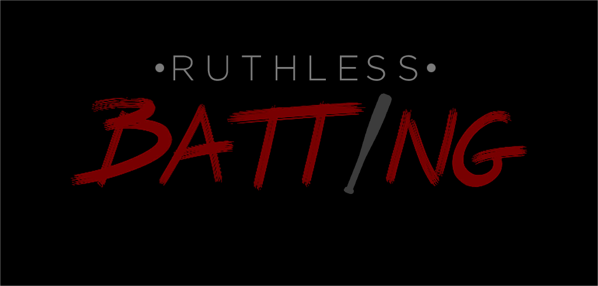

# Ruthless Batting

Ruthless Batting is a high-octane cyberpunk action game where you have to kill everyone that stand in your way. Featuring epic soundtrack, hardcore close combat, and ultra violence.​

This is a game (demo/protoype/vertical slice) developed by students from <a href="https://www.imagecampus.edu.ar/">Image Campus</a>

   

## Credits
(in alphabetical order)

- **Matías Ruiz Torres** - *Programming*, *Game Design* -  
- **Alejandro Axel Abecasis** - *Lead Programming* -  
- **Julian Cueto** - *Art* -     
- **Juan Fernández Etchegaray** - *Art* -     
- **Catalina Rozboril** - *Art* -     
- **Agustín Nicolas Llanos** - *Audio* -     
- **Francisco José Brito Evans** - *Audio* -     
- **Facundo Sargiotti** - *Testing* -     
- **José Hernán Canteros** - *Testing* -     

This game was also possible thanks to the support of these professors:

- **Sergio Baretto**
- **Jorge Cuéllar**
- **Fernando Puig**
- **Eugenio Taboada**

## Acknowledgements

Otras personas a las que quieran agradecerles, sino sacar este título

## Links

Download it from itch.io: https://ruthlessgames.itch.io/ruthless-batting
